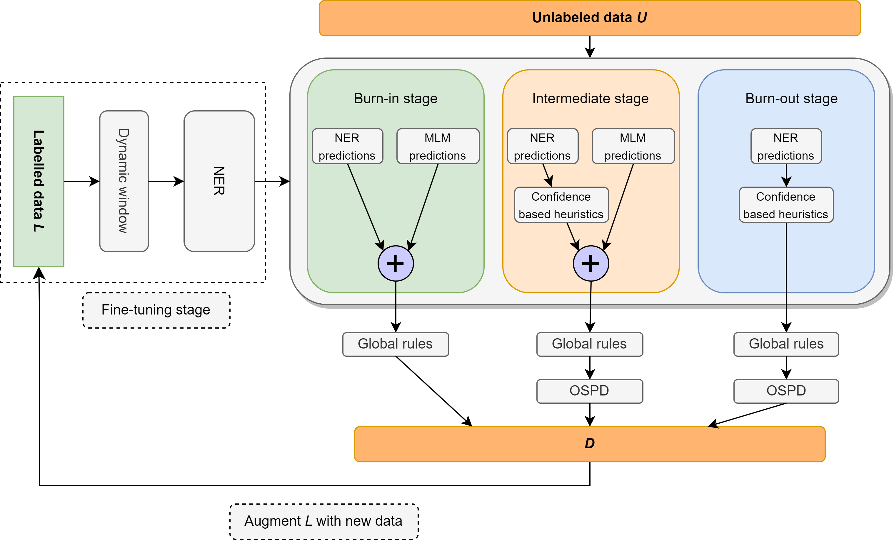

<h1 align="center">ELLEN: E<em>xtremely</em> L<em>ightly</em> <em>Supervised</em> L<em>earning</em> <em>For</em> E<em>fficient</em> N<em>amed</em> <em>Entity</em> <em>Recognition</em>
</h1>
<div align="center">
  <span class="author-block">Haris Riaz<sup>1†</sup>, </span>
  <span class="author-block">Razvan Dumitru<sup>1</sup>, </span>
  <span class="author-block">Mihai Surdeanu<sup>1</sup></span>
</div>
<div align="center">
  <span class="author-block"><sup>1</sup>University of Arizona</span>
  <span class="author-block"><sup>*</sup><sup>†</sup>Corresponding Author</span>
</div>

[](https://arxiv.org/abs/2403.17385)

## Introduction (Deep learning 🤝 Linguistics ⚡)
In this work, we revisit the problem of semi-supervised named entity recognition (NER) focusing on extremely light supervision, consisting of a lexicon containing only 10 examples per class. We introduce ELLEN, a simple, fully modular, neuro-symbolic method that blends fine-tuned language models with linguistic rules. These rules include insights such as "One Sense Per Discourse", using a Masked Language Model as an unsupervised NER, leveraging part-of-speech tags to identify and eliminate unlabeled entities as false negatives, and other intuitions about classifier confidence scores in local and global context. ELLEN achieves very strong performance on the CoNLL-2003 dataset when using the minimal supervision from the lexicon above. It also outperforms most existing (and considerably more complex) semi-supervised NER methods under the same supervision settings commonly used in the literature (i.e., 5% of the training data). Further, we evaluate our CoNLL-2003 model in a zero-shot scenario on WNUT-17 where we find that it outperforms GPT-3.5 and achieves comparable performance to GPT-4. In a zero-shot setting, ELLEN also achieves over 75% of the performance of a strong, fully supervised model trained on gold data.

<p align="center">
  
</p>

## Code (Coming soon!)
The camera ready code will be released over the next few weeks.

## Results

#### Extreme Light (1%) Supervision:

| Precision      | Recall        | F1            |
| -------------- | ------------- | ------------- |
| 74.63%   | 79.26%  | **76.87%**  |

#### 5% Supervision:
ELLEN† outperforms more complex methods such as PU-Learning and Variational Sequential Labelers (VSL-GG-Hier) when using 5% of the data as supervision.

| Methods       | P          | R          | F1         |
|---------------|------------|------------|------------|
| VSL-GG-Hier   | 84.13%     | 82.64%     | 83.38%     |
| MT + Noise    | 83.74%     | 81.49%     | 82.60%     |
| Semi-LADA     | 86.93%     | 85.74%     | 86.33%     |
| Jointprop     | 89.88%     | 85.98%     | **87.68%**     |
| PU-Learning   | 85.79%     | 81.03%     | 83.34%     |
| ELLEN†        | 81.88%| 88.01%| **84.87%**|


#### Zero-shot (WNUT-17)
| Method                                         | LOC          | MISC         | ORG          | PER          | AVG          |
|------------------------------------------------|--------------|--------------|--------------|--------------|--------------|
| [T-NER](https://github.com/asahi417/tner)      | 64.21%       | 42.04%       | 42.98%       | 66.11%       | **55.11%**       |
| GPT-3.5                                        | 49.17%       | 8.06%        | 29.71%       | 59.84%       | 39.96%       |
| GPT-4                                          | 58.70%       | 25.40%       | 38.05%       | 56.87%       | 43.72%       |
| ELLEN+                                         | 44.82% | 6.21%   | 26.49%  | 67.00%  | **41.56%**  |


## Fully Unsupervised NER with a Masked Language Model (MLM)

We introduce a very strong baseline for fully unsupervised NER using less than 10-shots (over 56% F1 on CoNLL-03 dev!)

| Entity Type | Precision | Recall  | F1     |
|-------------|-----------|---------|--------|
| Overall     | 61.78%    | 51.90%  | 56.41% |
| LOC         | 69.72%    | 41.53%  | 52.05% |
| MISC        | 45.18%    | 55.15%  | 49.67% |
| ORG         | 44.85%    | 40.88%  | 42.77% |
| PER         | 85.07%    | 65.02%  | 73.71% |


## Citation
If you find this work useful, please consider citing:
```
@misc{riaz2024ellen,
      title={ELLEN: Extremely Lightly Supervised Learning For Efficient Named Entity Recognition}, 
      author={Haris Riaz and Razvan-Gabriel Dumitru and Mihai Surdeanu},
      year={2024},
      eprint={2403.17385},
      archivePrefix={arXiv},
      primaryClass={cs.CL}
}
```

## Usage and License Notices:
The code released in this repository is free to use for most circumstances under the MIT license.

## Contact
Haris Riaz (harisriaz1700@gmail.com) or (hriaz@arizona.edu)